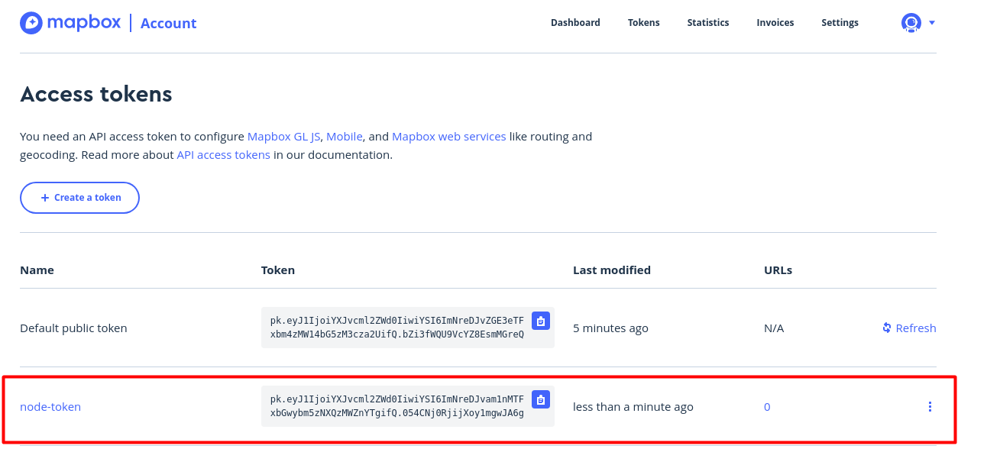
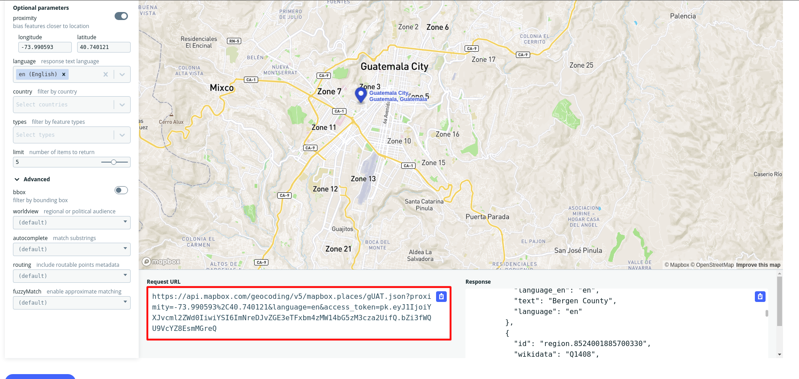
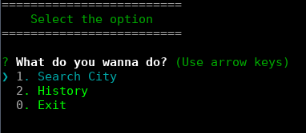

create package.json 
```sh
npm init -y
```

I added to my package.json this line to run my app
```json

  "scripts": {
    "start":"node index.js"
  },
```
And after that change I can run my app in this way
```javascript
npm start
```

I install these packages: colors, inquirer, dotenv, axios
```javascript
npm i colors inquirer  dotenv axios
```
## Packages and Tools used and recomended
- [Colors](https://www.npmjs.com/package/colors)
- [Inquirer](https://www.npmjs.com/package/inquirer)
- [Request](https://www.npmjs.com/package/request) -> This is deprecated, but it's usefull
- [Fetch](https://www.npmjs.com/package/fetch) -> we can use this on backend, because the fetch in javascript doesn't work we need to install this to use Fetch on Backend
- [Axios](https://www.npmjs.com/package/axios) -> This the most recommended.
- [Test real API Quickly](https://reqres.in/)
- [MapBox](https://www.mapbox.com/)
- [Geocoding](https://docs.mapbox.com/api/search/geocoding/)
- [Dotenv](https://www.npmjs.com/package/dotenv) -> load enviroment variables
- [OpenWeatherMap](https://openweathermap.org/)


## Extension Chrome to view a JSON formatter
[JSON Viewer](https://chrome.google.com/webstore/detail/json-viewer/gbmdgpbipfallnflgajpaliibnhdgobh/related?hl=es)


We can see the enviroment variables of our app
```javascript
console.log(process.env);
```
The result
```json
  'MAPBOX-KEY': 'pk.eyJ1IjoiYXJvcml2ZWd0IiwiYSI6ImNreDJvZGE3eTFxbm4zMW14bG5zM3cza2UifQ.bZi3fWQU9VcYZ8EsmMGreQ'
```






Request of our API MAPBOX

- https://api.mapbox.com/geocoding/v5/mapbox.places/gUAT.json?proximity=-73.990593%2C40.740121&language=en&access_token=pk.eyJ1IjoiYXJvcml2ZWd0IiwiYSI6ImNreDJvZGE3eTFxbm4zMW14bG5zM3cza2UifQ.bZi3fWQU9VcYZ8EsmMGreQ
```json
// 20211212160448
// https://api.mapbox.com/geocoding/v5/mapbox.places/gUAT.json?proximity=-73.990593%2C40.740121&language=en&access_token=pk.eyJ1IjoiYXJvcml2ZWd0IiwiYSI6ImNreDJvZGE3eTFxbm4zMW14bG5zM3cza2UifQ.bZi3fWQU9VcYZ8EsmMGreQ

{
  "type": "FeatureCollection",
  "query": [
    "guat"
  ],
  "features": [
    {
      "id": "poi.1279900300528",
      "type": "Feature",
      "place_type": [
        "poi"
      ],
      "relevance": 1,
      "properties": {
        "foursquare": "4e4cee3dbd413c4cc66d51f4",
        "landmark": true,
        "address": "362 Anderson Ave",
        "category": "latin american restaurant, latin american food, restaurant"
      },
      "text_en": "Guatemala Corner Restaurant",
      "place_name_en": "Guatemala Corner Restaurant, 362 Anderson Ave, Cliffside Park, New Jersey 07010, United States",
      "text": "Guatemala Corner Restaurant",
      "place_name": "Guatemala Corner Restaurant, 362 Anderson Ave, Cliffside Park, New Jersey 07010, United States",
      "center": [
        -73.992945,
        40.818506
      ],
      "geometry": {
        "coordinates": [
          -73.992945,
          40.818506
        ],
        "type": "Point"
      },
      "context": [
        {
          "id": "neighborhood.3267609707654530",
          "text_en": "Hudson Heights",
          "text": "Hudson Heights"
        },
        {
          "id": "postcode.9325224277785100",
          "text_en": "07010",
          "text": "07010"
        },
        {
          "id": "place.12621844957533920",
          "wikidata": "Q1087360",
          "text_en": "Cliffside Park",
          "language_en": "en",
          "text": "Cliffside Park",
          "language": "en"
        },
        {
          "id": "district.7492509872552970",
          "wikidata": "Q112915",
          "text_en": "Bergen County",
          "language_en": "en",
          "text": "Bergen County",
          "language": "en"
        },
        {
          "id": "region.8524001885700330",
          "wikidata": "Q1408",
          "short_code": "US-NJ",
          "text_en": "New Jersey",
          "language_en": "en",
          "text": "New Jersey",
          "language": "en"
        },
        {
          "id": "country.19678805456372290",
          "wikidata": "Q30",
          "short_code": "us",
          "text_en": "United States",
          "language_en": "en",
          "text": "United States",
          "language": "en"
        }
      ]
    },
    {
      "id": "country.10004903499752530",
      "type": "Feature",
      "place_type": [
        "country"
      ],
      "relevance": 1,
      "properties": {
        "wikidata": "Q774",
        "short_code": "gt"
      },
      "text_en": "Guatemala",
      "language_en": "en",
      "place_name_en": "Guatemala",
      "text": "Guatemala",
      "language": "en",
      "place_name": "Guatemala",
      "bbox": [
        -92.3566105298246,
        13.6517966258875,
        -88.2111927824501,
        17.816632999923
      ],
      "center": [
        -90.3900017126126,
        15.6055893260292
      ],
      "geometry": {
        "type": "Point",
        "coordinates": [
          -90.3900017126126,
          15.6055893260292
        ]
      }
    },
    {
      "id": "place.13684067145752530",
      "type": "Feature",
      "place_type": [
        "place"
      ],
      "relevance": 1,
      "properties": {
        "wikidata": "Q1555"
      },
      "text_en": "Guatemala City",
      "language_en": "en",
      "place_name_en": "Guatemala City, Guatemala, Guatemala",
      "text": "Guatemala City",
      "language": "en",
      "place_name": "Guatemala City, Guatemala, Guatemala",
      "bbox": [
        -90.57577,
        14.53599,
        -90.379263,
        14.713547
      ],
      "center": [
        -90.53139,
        14.62278
      ],
      "geometry": {
        "type": "Point",
        "coordinates": [
          -90.53139,
          14.62278
        ]
      },
      "context": [
        {
          "id": "region.12425942921752530",
          "wikidata": "Q695660",
          "short_code": "GT-GU",
          "text_en": "Guatemala",
          "language_en": "en",
          "text": "Guatemala",
          "language": "en"
        },
        {
          "id": "country.10004903499752530",
          "wikidata": "Q774",
          "short_code": "gt",
          "text_en": "Guatemala",
          "language_en": "en",
          "text": "Guatemala",
          "language": "en"
        }
      ]
    },
    {
      "id": "region.12425942921752530",
      "type": "Feature",
      "place_type": [
        "region"
      ],
      "relevance": 1,
      "properties": {
        "wikidata": "Q695660",
        "short_code": "GT-GU"
      },
      "text_en": "Guatemala",
      "language_en": "en",
      "place_name_en": "Guatemala, Guatemala",
      "text": "Guatemala",
      "language": "en",
      "place_name": "Guatemala, Guatemala",
      "bbox": [
        -90.7624069710871,
        14.24253509623,
        -90.2118824852298,
        14.9147349941434
      ],
      "center": [
        -90.51306,
        14.64139
      ],
      "geometry": {
        "type": "Point",
        "coordinates": [
          -90.51306,
          14.64139
        ]
      },
      "context": [
        {
          "id": "country.10004903499752530",
          "wikidata": "Q774",
          "short_code": "gt",
          "text_en": "Guatemala",
          "language_en": "en",
          "text": "Guatemala",
          "language": "en"
        }
      ]
    },
    {
      "id": "poi.8590014859",
      "type": "Feature",
      "place_type": [
        "poi"
      ],
      "relevance": 1,
      "properties": {
        "foursquare": "4d84b54f37ddba7aadceb0e4",
        "landmark": true,
        "address": "1147 Hamilton Ave",
        "category": "bakery, shop"
      },
      "text_en": "Guatepan Bakery",
      "place_name_en": "Guatepan Bakery, 1147 Hamilton Ave, Trenton, New Jersey 08629, United States",
      "text": "Guatepan Bakery",
      "place_name": "Guatepan Bakery, 1147 Hamilton Ave, Trenton, New Jersey 08629, United States",
      "center": [
        -74.733292,
        40.219269
      ],
      "geometry": {
        "coordinates": [
          -74.733292,
          40.219269
        ],
        "type": "Point"
      },
      "context": [
        {
          "id": "postcode.12625722107549730",
          "text_en": "08629",
          "text": "08629"
        },
        {
          "id": "place.5435529424458310",
          "wikidata": "Q25330",
          "text_en": "Trenton",
          "language_en": "en",
          "text": "Trenton",
          "language": "en"
        },
        {
          "id": "district.12400460927209970",
          "wikidata": "Q496886",
          "text_en": "Mercer County",
          "language_en": "en",
          "text": "Mercer County",
          "language": "en"
        },
        {
          "id": "region.8524001885700330",
          "wikidata": "Q1408",
          "short_code": "US-NJ",
          "text_en": "New Jersey",
          "language_en": "en",
          "text": "New Jersey",
          "language": "en"
        },
        {
          "id": "country.19678805456372290",
          "wikidata": "Q30",
          "short_code": "us",
          "text_en": "United States",
          "language_en": "en",
          "text": "United States",
          "language": "en"
        }
      ]
    }
  ],
  "attribution": "NOTICE: © 2021 Mapbox and its suppliers. All rights reserved. Use of this data is subject to the Mapbox Terms of Service (https://www.mapbox.com/about/maps/). This response and the information it contains may not be retained. POI(s) provided by Foursquare."
}

```
request of our API Open WeatherMap

- api.openweathermap.org/data/2.5/weather?lat=-15.6055893260292&lon=-90.3900017126126&appid=e417ea1323118d6fd1406154206afac7
```json
{
    "coord": {
        "lon": -90.39,
        "lat": -15.6056
    },
    "weather": [
        {
            "id": 803,
            "main": "Clouds",
            "description": "broken clouds",
            "icon": "04d"
        }
    ],
    "base": "stations",
    "main": {
        "temp": 292.74,
        "feels_like": 292.66,
        "temp_min": 292.74,
        "temp_max": 292.74,
        "pressure": 1016,
        "humidity": 73,
        "sea_level": 1016,
        "grnd_level": 1016
    },
    "visibility": 10000,
    "wind": {
        "speed": 7.61,
        "deg": 122,
        "gust": 8.56
    },
    "clouds": {
        "all": 74
    },
    "dt": 1639346475,
    "sys": {
        "sunrise": 1639308263,
        "sunset": 1639355202
    },
    "timezone": -21600,
    "id": 0,
    "name": "",
    "cod": 200
}
```

This is my final application

