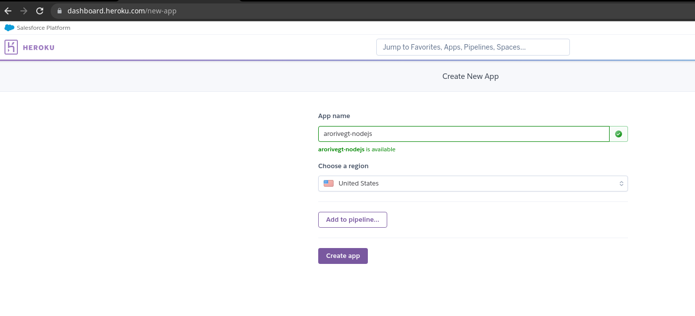
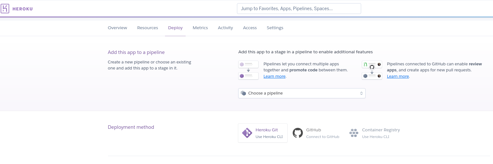

create package.json 
```sh
npm init -y
```

I added to my package.json this line to run my app
```json

  "scripts": {
    "start":"node index.js"
  },
```
And after that change I can run my app in this way
```javascript
npm start
```

but if you don't want to run your app every time that you do a change, you can use nodemon, and this command listen to when there are a lot of changes in our files, after we starte  we need to install in our app
```javascript
npm install nodemon --save-dev
nodemon app
```

I install these packages: colors, inquirer, dotenv, axios
```javascript
npm i express hbs doteenv
```
## Packages and Tools used and recomended
- [Express - NPM](https://www.npmjs.com/package/express) -> Framework for Node
- [Express Official Page](http://expressjs.com/)
- [handlebars](https://www.npmjs.com/package/handlebars) -> create dynamic web page, in this case we need to go to GibHub, 
- [handlebars - nodejs](https://github.com/pillarjs/hbs)because we need to instal this specific package to work on Nodejs npm install hbs
- [Dotenv](https://www.npmjs.com/package/dotenv) -> establish my enviroment variable
 
## Extension Chrome to view a JSON formatter
[JSON Viewer](https://chrome.google.com/webstore/detail/json-viewer/gbmdgpbipfallnflgajpaliibnhdgobh/related?hl=es)

How to prepare WebServer to upload it to a hosting
- First I need to use .env and use the package dotenv to add my PORT like a enviroment variable
- Second I need to expecify a command in my package.json and add the following line, because many of hosting are waiting for this command to run a Node App, but that depend of the hosting:
```json
  "scripts": {
    "test": "echo \"Error: no test specified\" && exit 1",
    "start": "node app.js" 
  },
```

If I want to deploy my website made with NodeJS to a hosting, I have many options like those:
- [Firebase](https://firebase.google.com/docs/hosting?hl=es)
- [Azure](https://azure.microsoft.com/en-ca/free/search/)
- [AWS](https://aws.amazon.com/free/)
- [Google Cloud](https://cloud.google.com/)
- [Digital Ocean](https://try.digitalocean.com/developerbrand/)
- [Linode](https://www.linode.com/lp/free-credit-100/?promo=sitelin100&promo_value=100&promo_length=60&utm_source=google&utm_medium=cpc&utm_campaign=11178784753_109179228883&utm_term=g_aud-843709888229:kwd-2629795801_e_linode&utm_content=466940507261&locationid=9077181&device=c_c&gclid=Cj0KCQiAnuGNBhCPARIsACbnLzqJTl6ShFRz8DW8b-aTvMZ6lrQLJ4_gzFUptW-h4f77m5Dm8r6CqbkaAqM3EALw_wcB)
- [Heroku](https://www.heroku.com/)

For this app we're gonna use Heroku and we need to create an account and we can see a button where we can create our app with a unique name like this:



and after that we see another screen where we have diffent option to upload our webserver, and we're gonna use Heroku CLI and for that we need to install Heroku in our Operative System, I'm using Debian and I installed Heroku with this command


- [Install Heroko CLI](https://devcenter.heroku.com/articles/heroku-cli)
- I Only use the following command
```bash
curl https://cli-assets.heroku.com/install.sh | sh
```
- Finally I use the following command to be sure that I install Heroku
```bash
heroku --version
## heroku/7.59.2 linux-x64 node-v12.21.0  -> I need to see that to be sure that I install Heroku correctly
```
- after we have been able to install Heroku we use the following command to conect the CLI with our account
```bash
heroku login
```
- We need to follow the step that say in Heroku
```bash
#Initialize a git repository in a new or existing directory
cd my-project/ ## I need to move to my proyect
git init
heroku git:remote -a arorivegt-nodejs ## I need to excecute this command to connect with a Heroku Repository
git commit -am "Upload my proyecto to Heroku"
git push heroku master
```

If I don't know whre is my URL link I can push the button Open App:


After all that,Heroku say me where is my URL to see my application
- [NodeJS - Bootstrap](https://arorivegt-nodejs.herokuapp.com/)

This is my final application


