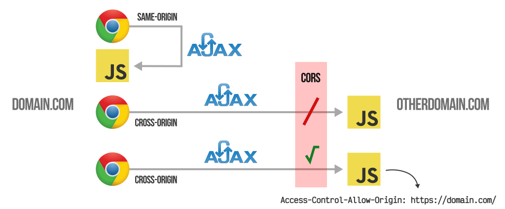
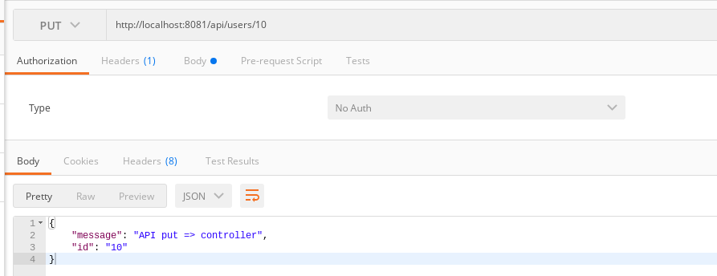
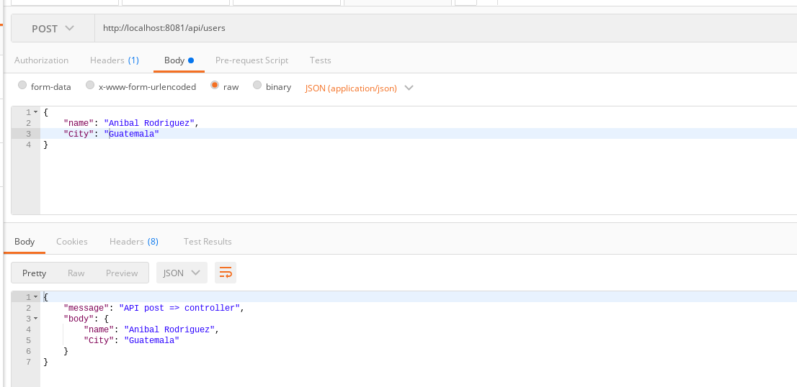
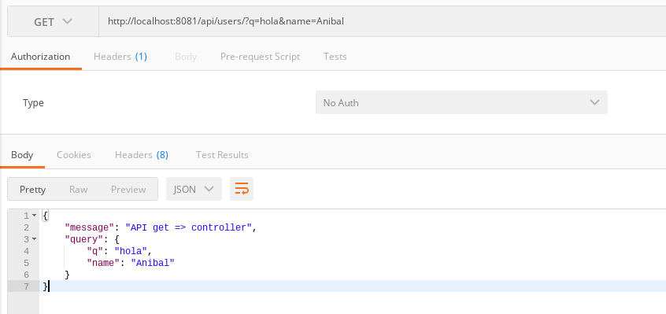

create package.json 
```sh
npm init -y
```

I added to my package.json this line to run my app
```json

  "scripts": {
    "start":"node index.js"
  },
```
And after that change I can run my app in this way
```javascript
npm start
```

but if you don't want to run your app every time that you do a change, you can use nodemon, and this command listen to when there are a lot of changes in our files, after we starte  we need to install in our app
```javascript
npm install nodemon --save-dev
nodemon app
```

I install these packages: colors, inquirer, dotenv, axios
```javascript
npm i express dotenv cors
```
## Packages and Tools used and recomended
- [Express - NPM](https://www.npmjs.com/package/express) --> Framework for Node
- [Express Official Page](http://expressjs.com/)
- [Dotenv](https://www.npmjs.com/package/dotenv) --> establish my enviroment variable
- [Cors](https://www.npmjs.com/package/cors) --> CORS is a node.js package for providing a Connect/Express middleware that can be used to enable CORS with various options.
 


I can get the data in that way when we send something like this



```javascript

//routes/user.js
router.put('/:id', putUsers)

//controllers/user.controller.js
const putUsers = (req, res = response) => {
    const id = req.params.id;
    //res.status(200).json({ add status to return
    res.json({
        message: "API put => controller",
        id
    })
}
```


I can get the data in that way when we send something like this



```javascript

//routes/user.js
router.post('/', postUsers)

//controllers/user.controller.js
const postUsers = (req, res = response) => {

    const { name, City } = req.body;
    

    //res.status(200).json({ add status to return
    res.json({
        message: "API post => controller",
        name,
        City
    })
}
```


I can get the data in that way when we send something like this



```javascript

//routes/user.js
router.get('/', getUsers);

//controllers/user.controller.js
const getUsers = (req = request, res = response) => {

    const { q, name, apiKey = "Key Not Found" } = req.query;
    //res.status(200).json({ add status to return
    res.json({
        message: "API get => controller",
        q,
        name,
        apiKey
    })
}
```

If we use Git, we can use this command when we lost something
```bash
git checkout -- .
```

## Extension Chrome to view a JSON formatter
[JSON Viewer](https://chrome.google.com/webstore/detail/json-viewer/gbmdgpbipfallnflgajpaliibnhdgobh/related?hl=es)